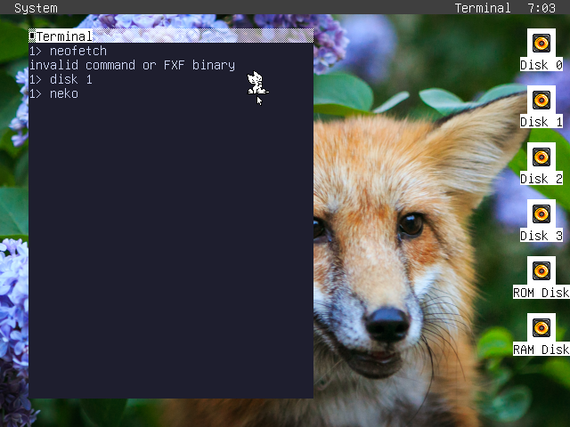

# Neko
A port of the classic [Neko](https://en.wikipedia.org/wiki/Neko_(software)) program for fox32.



# Building and Running
```sh
fox32asm neko.asm neko.fxf
ryfs.py create neko.img
ryfs.py add neko.img neko.fxf
fox32 --disk fox32os.img --disk neko.img
```
